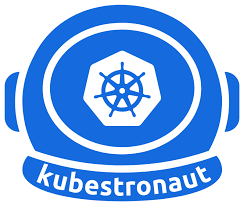
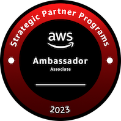
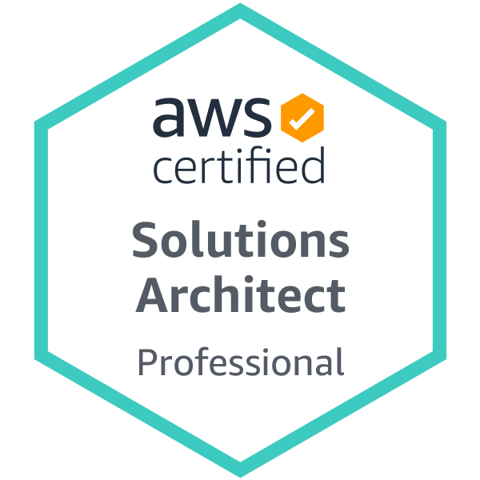
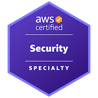
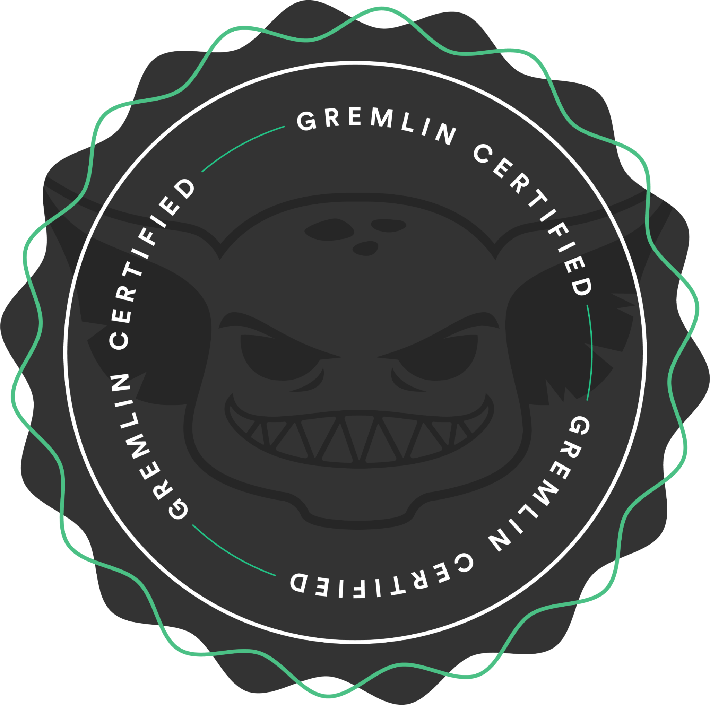
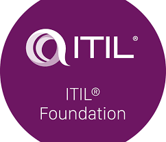

### Hi there 👋

 
 

Hello,
I'm [Ahmet AYDIN](https://www.linkedin.com/in/ahmetayd/), a Senior DevOps Consultant with more than 20 years of experience in IT infrastructures. I have been holding 32 professional IT certifications, including expertise in OnPrem to AWS, Azure, and GCP cloud migrations.

My specialties include designing and implementing platform pipelines, orchestrating container platforms with Kubernetes, Docker Swarm, and Rancher, and developing and maintaining automated CI/CD pipelines using tools such as Jenkins, Ansible, Terraform, and Pulumi. I am passionate about utilizing SDLC-based code build and deployment processes to deliver efficient and scalable solutions.

Feel free to explore my GitHub profile to see my latest projects and contributions!
 
 

<!--
**ahmetayd/ahmetayd** is a ✨ _special_ ✨ repository because its `README.md` (this file) appears on your GitHub profile.

Here are some ideas to get you started:

- 🔭 I’m currently working on ...
- 🌱 I’m currently learning ...
- 👯 I’m looking to collaborate on ...
- 🤔 I’m looking for help with ...
- 💬 Ask me about ...
- 📫 How to reach me: ...
- 😄 Pronouns: ...
- ⚡ Fun fact: ...
-->
