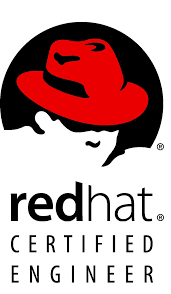

### Hi there 👋

 
 

Hello,
I'm [Ahmet AYDIN](https://www.linkedin.com/in/ahmetayd/), working as Senior DevOps Consultant at [Kloia](https://www.kloia.com).

I have more than 19 years of experience based on IT infrastructures, I contributed 150+ projects!

- Design and implement Platform pipelines,
- Migrate legacy infrastructures to cloud (AWS, Azure, GCP),
- Design and orchestrate container platforms using Rancher, Kubernetes, Docker Swarm, or managed engines,
- Design and Implement SDLC-based code build and deployment processes,
- Develop and Maintain automated CI/CD pipelines ( using automation tools Jenkins, Ansible, Terraform, Pulumi, Crossplane, etc.)

I have 27 professional IT certifications.

Here it is some of them:

<!--
**ahmetayd/ahmetayd** is a ✨ _special_ ✨ repository because its `README.md` (this file) appears on your GitHub profile.

Here are some ideas to get you started:

- 🔭 I’m currently working on ...
- 🌱 I’m currently learning ...
- 👯 I’m looking to collaborate on ...
- 🤔 I’m looking for help with ...
- 💬 Ask me about ...
- 📫 How to reach me: ...
- 😄 Pronouns: ...
- ⚡ Fun fact: ...
-->
